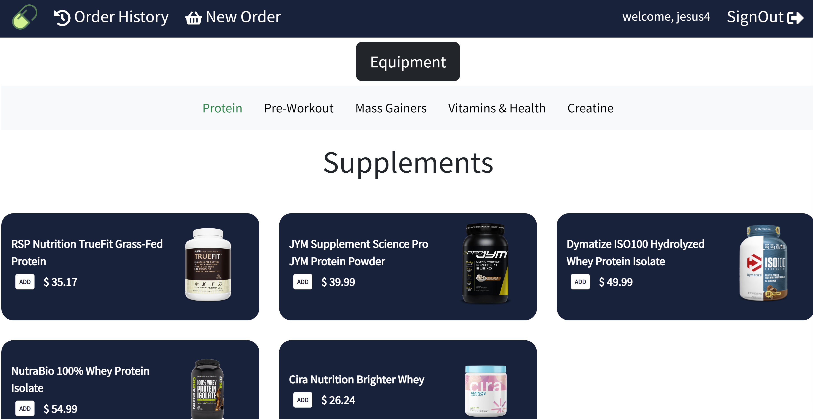
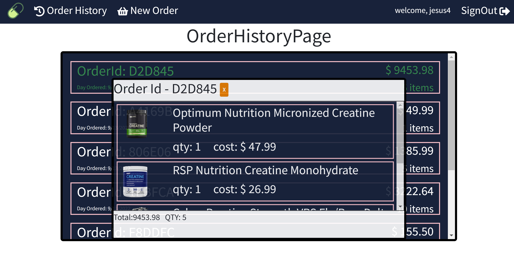

# Green Pill

Green Pill is a browser-based ECommerced application for purchases gym related items. After Creating your account, the user is welcomed with a shopping page where you can click the add button and have it rendered into your cart. After you've added all that you needed, you can checkout the purchase, which would render you to your history order page to preview old orders.

## ScreenShots

## Technologies

## Getting Started
### Link to the ECommerce Application
<a href="https://green-pill.herokuapp.com/orders/new" target="_blank">GREEN PILL</a>

### Link to Trello Board

<a href="https://trello.com/b/y0SkAvv0/capstone" target="_blank">Trello Board</a>

## Next Steps/ ICE box

- A search functionality where you can search specific manga
- Reviews functionality
- presenting a weight tracker